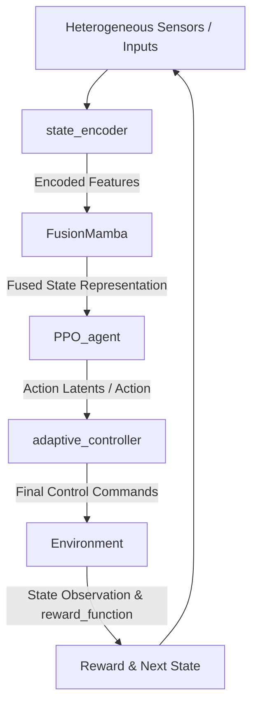

# HM-RL-FusionMamba: Heterogeneous Multi-modal Reinforcement Learning with Fusion Mamba

A research-oriented, PyTorch-based framework implementing **HM-RL-FusionMamba** for heterogeneous multi-modal state encoding, fusion, and control using State Space Models (SSMs) and Proximal Policy Optimization (PPO).

This repository is structured to support clean, modular development suitable for IEEE publications, complexity benchmarks, and future robotic/control extensions.

---

## 1. Project Architecture

The architecture represents a closed-loop control system that processes multi-modal inputs to output adaptive control commands:



- **`datasets`**: Utilities to load offline training data, demonstration trajectories, or environments.
- **`state_encoder`**: Domain-specific encoders (e.g., CNNs for vision, MLPs for proprioceptive states) that project heterogeneous inputs to a shared embedding space.
- **`FusionMamba`**: A fusion network leveraging Mamba (State Space Model) blocks to model temporal dependencies and multi-modal interactions with linear complexity.
- **`PPO_agent`**: Actor-Critic implementation executing Proximal Policy Optimization with continuous/discrete actions.
- **`adaptive_controller`**: Integrates RL actions with classical/adaptive control laws (e.g., PID/MPC) to ensure stability and constraint satisfaction.
- **`reward_function`**: Reward shaping algorithms reflecting complex multi-objective optimization.
- **`training`**: Orchestration of the RL training loop, rollout storage, and gradient updates.
- **`evaluation`**: Scripts to run inference, calculate metrics, and generate publication-quality figures.
- **`complexity_analysis`**: Utilities to count FLOPs, parameters, and benchmark execution latency.

---

## 2. Getting Started

### Installation
Clone this repository and install the dependencies:
```bash
pip install -r requirements.txt
```

### Usage
Run the main script with command-line arguments to train, evaluate, or benchmark the model:

```bash
# Train the model
python main.py --mode train --config config.py

# Evaluate a trained checkpoint
python main.py --mode eval --checkpoint results/best_model.pt

# Run complexity analysis (FLOPs, parameters, latency)
python main.py --mode benchmark
```

---

## 3. Directory Layout

A summary of the codebase structure:
* `datasets/`: Dataset loaders (`custom_dataset.py`)
* `FusionMamba/`: Mamba block (`mamba_block.py`) & Multi-modal fusion (`fusion_module.py`)
* `state_encoder/`: Shared projection/embedding encoders (`encoder.py`)
* `PPO_agent/`: Actor-Critic architectures (`actor_critic.py`) & PPO policy (`ppo_algorithm.py`)
* `adaptive_controller/`: Safe/adaptive control filters (`controller.py`)
* `reward_function/`: Reward metrics and formulation (`reward.py`)
* `training/`: Orchestrates rollouts, training steps, and logging (`trainer.py`)
* `evaluation/`: Benchmarking, plotting, and testing (`evaluator.py`, `metrics.py`)
* `complexity_analysis/`: Measures computational efficiency (`benchmark.py`)
* `results/`: Directory for log files, training plots, and tensorboard outputs

---

## Citation
If you use this code in your research, please cite our paper:
```bibtex
@article{hm_rl_fusionmamba2026,
  title={Heterogeneous Multi-modal Reinforcement Learning with Fusion Mamba},
  author={HM-RL-FusionMamba Contributors},
  journal={IEEE Transactions on Robotics / Neural Networks and Learning Systems (Pending)},
  year={2026}
}
```
